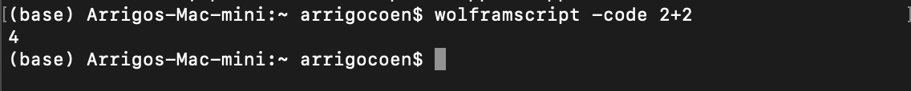
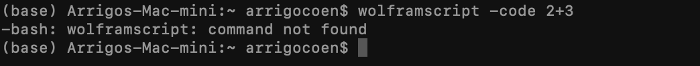

# How-to-use-wolframscript

Wolframscript is a tool to run Mathematica through the terminal. In this repo I will present how I use R to generate automatically .wls files to run Mathematica code in a remote cluster.

For purpose of exemplify, let us assume that we want to run the code:

```
Solve[{x == y - 13, y == 4 x + 23}]
```
To install the Wolframscript app download it from:
[https://reference.wolfram.com/language/workflow/InstallWolframScript.html](https://reference.wolfram.com/language/workflow/InstallWolframScript.html)

To check if it is installed, run the command the terminal `wolframscript -code 2+2`, and something equivalent to 

But, if you get something like

you don't have installed Wolframscript.

## Generating a .wls file

Since we will manipulate Mathematica using R, we assume that we have an script in R with
```
text_to_run <- "Solve[{x == y - 13, y == 4 x + 23}]"
path_nb_file <- "/WLS_files_local"
file_name <- "Solving_equation_with_WS"
```
Now, we could use the function `gen_nb_file` using the command
```
gen_nb_file(file_name,text_to_run,path_nb_file, add_print=F)
```
where the last variable tells the function if it need to add the command `Print[... ]`to the .nb file. After running this last R function we get a file like


Since Wolframscript uses .wls, we need to transform the .nb file into a .wls file. To do this, open the .nb and select the cell and initialize it.

Then we `Save as...`using the Mathematica framework and we chose save as `.wls`


## Coping the file to the destination on the cluster

We use the terminal to run the command `scp`. This command uses the structure `scp File_to_copy.wls Destinatian_to_copy`for instance, we could use the variables:
* File_to_copy.wls = "Solving_equation_with_WS"
* Destinatian_to_copy = "My_destination_on_the_cluster"
For instance, `scp /WLS_files_local/Solving_equation_with_WS.wls WLS_files_cluster`

Moreover, if you have a folder with all your .wls files and you want to copy all: first, step on the folder using the `cd` command of the terminal, and second use `File_to_copy.wls = "*.wls"`. The asterisk will allow us to copy all the .wls files. For example,
```
cd "WLS_files_local"
scp *.wls WLS_files_cluster
```
## Running the .wls and saving the output

Finally, to run the .wls files using the terminal command 
```
wolframscript -script Solving_equation_with_WS.wls > out_Solving_equation_with_WS.txt
```
This las command, tells Wolframscript to run the file ` Solving_equation_with_WS.wls` and save the output as the .txt file `out_Solving_equation_with_WS.txt`. Also one could use the command 
```
wolframscript -script Solving_equation_with_WS.wls 
```
to print the output directly to the console. More information about how to save the output could be consulted on More about of copy the output in [here](https://askubuntu.com/questions/420981/how-do-i-save-terminal-output-to-a-file).


First, I can't use wolframscript at the terminal, since I get the message
 


So.... lets fix this!

## Dowload Wolframscript

Go to the page:
[https://reference.wolfram.com/language/workflow/InstallWolframScript.html](https://reference.wolfram.com/language/workflow/InstallWolframScript.html)

Examples of how to use wolframscript 
[https://reference.wolfram.com/language/ref/program/wolframscript.html](https://reference.wolfram.com/language/ref/program/wolframscript.html)

An example of wolframscript on terminal
>>> wolframscript -code 2+2


wolframscript -script test.m
math -script test.m


This option do somethin
>>> cd "/Users/arrigocoen/Dropbox/1 How to/How-to-use-wolframscript"
>>> wolframscript -script test.m

If i run 
>>> wolframscript -script test.m &> out_test.txt; 
I get a txt with the message of the error,
even if I add the line 
$Pre = Quiet
to the .nb file 

Remember that you need to initialize the cell and to save the file as .m (use save as for this last part)

wolframscript -script test2.m &> out_test.txt; 

wolframscript -file test2.wls


wolframscript -script test4.wls > out_test4.txt


Copiando archivos de local al cluster

cd "/Users/arrigocoen/Dropbox/1 How to/How-to-use-wolframscript"

scp test4.wls acoencoria@solislemus-001.discovery.wisc.edu:/mnt/dv/wid/projects1/SolisLemus-ArrigoCC/

/Users/arrigocoen/Dropbox/1 How to/How-to-use-wolframscript


% More about of copy the output in https://askubuntu.com/questions/420981/how-do-i-save-terminal-output-to-a-file


