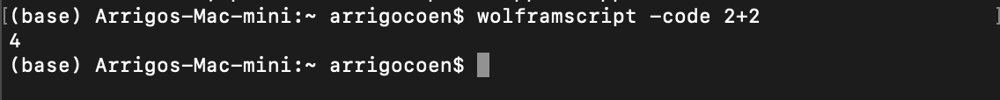
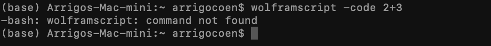
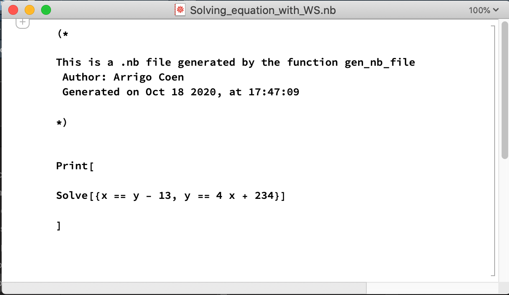
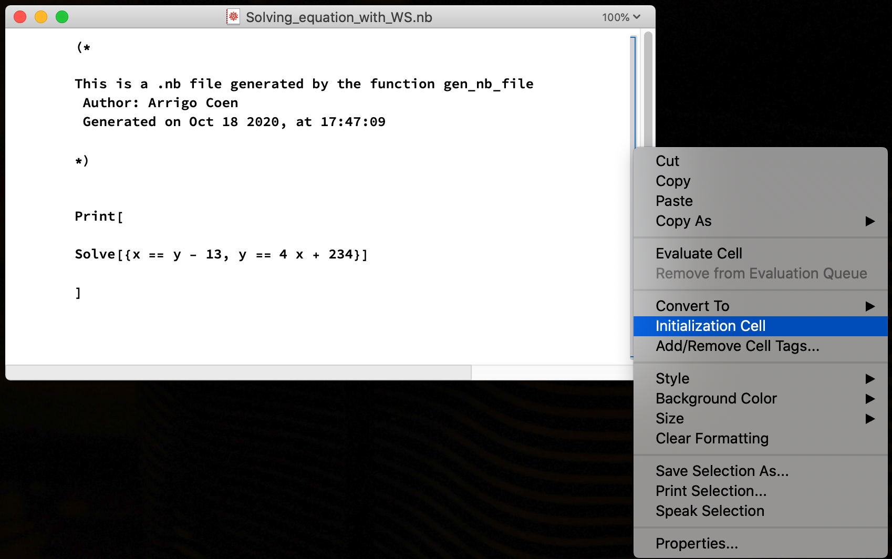
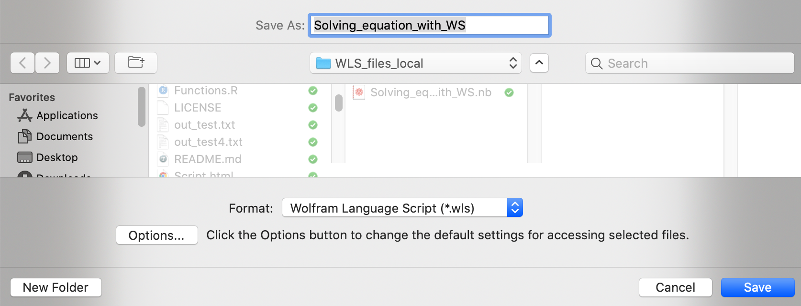

# How-to-use-wolframscript

Wolframscript is a tool to run Mathematica through the terminal. In this repo I will present how I use R to generate automatically .wls files to run Mathematica code in a remote cluster. The R function could are in the file `Function.R` of this repository.

For purpose of exemplify, let us assume that we want to run the code:

```
Solve[{x == y - 13, y == 4 x + 23}]
```
To install the Wolframscript app download it from [here](https://reference.wolfram.com/language/workflow/InstallWolframScript.html). To check if it is installed, run the command the terminal `wolframscript -code 2+2`, and something equivalent to 

But, if you get something like

you don't have installed Wolframscript.

## Generating a .wls file

Since we will manipulate Mathematica using R, we assume that we have an script in R with the variables
```
text_to_run <- "Solve[{x == y - 13, y == 4 x + 234}]"
folder_nb_file <- "WLS_files_local"
file_name <- "Solving_equation_with_WS"
```
Now, we could use the function `gen_nb_file` using the command
```
gen_nb_file(file_name,text_to_run,folder_nb_file, add_print=T)
```
where the last variable adds the text `Print[... ]`to the `.nb` file. After running this last R function we get a `.nb` file like


Since Wolframscript uses .wls, we need to transform the `.nb` file into a `.wls` file. To do this, open the `.nb` and select the cell and initialize it.

Then we use the Mathematica `Save as...` interface, and chose `.wls`


## Coping the file to the destination on the cluster

Since we are assuming that the files will be run on a cluster, we will use the Terminal to copy the files. First, we present how to copy a file using the Terminal, and second we explain how to use R to manipulate the Terminal to copy a file. This two options could be sound to much trouble to something that is as easy as a `ctl+c, ctl+v` but since we are assuming the use of a remote cluster, both options could be helpful. 

### Using the Terminal to copy the file
Now, we need to copy the files in folder of the cluster that we will use. Here, we will copy them using R to manipulate the Terminal. To this end we the Terminal command `scp`. This command uses the structure `scp File_to_copy.wls Destinatian_to_copy`for instance, we could use the variables:
* File_to_copy = "Solving_equation_with_WS"
* Destinatian_to_copy = "My_destination_on_the_cluster"

In this last case, we get, 
```
scp /WLS_files_local/Solving_equation_with_WS.wls WLS_files_cluster
```

Moreover, if you have a folder with all your .wls files and you want to copy all: first, step on the folder using the `cd` command of the terminal, and second use `File_to_copy.wls = "*.wls"`. The asterisk will allow us to copy all the `.wls` files. For example,
```
cd "WLS_files_local"
scp *.wls WLS_files_cluster
```

### Using R to copy the file

In this second methodology of copy a file, we use the function `copy_using_Terminal` function. For that, we use the next code:
```
folder_nb_file <- "WLS_files_local"
file_to_copy <- "Solving_equation_with_WS.wls"
path_of_the_copied_file <-  "Folder_of_cluster"
copy_using_Terminal(file_to_copy, folder_nb_file, path_of_the_copied_file)
```
This function internally runs the command `system`, that controls the Terminal using R.

## Running the .wls and saving the output

Finally, to run the .wls files using the terminal command 
```
wolframscript -script Solving_equation_with_WS.wls > out_Solving_equation_with_WS.txt
```
This las command, tells Wolframscript to run the file ` Solving_equation_with_WS.wls` and save the output as the .txt file `out_Solving_equation_with_WS.txt`. Also one could use the command 
```
wolframscript -script Solving_equation_with_WS.wls 
```
to print the output directly to the console. More information about how to save the output could be consulted on More about of how to copy the output using the Terminal could be consulted in [here](https://askubuntu.com/questions/420981/how-do-i-save-terminal-output-to-a-file).

### Running the wolfromscript using R

To run the wolframscript using R we use the function `rut_Terminal_using_R`. An example of how to run this function is:
```
folder_files_wls <- "Folder_of_cluster"
wls_file_to_run <- "Solving_equation_with_WS.wls"
output_name <- "output_Solving_equation_with_WS.txt"
rut_Terminal_using_R(folder_files_wls, wls_file_to_run, output_name)
```
This function uses the `system`command to run the wolframscript.


